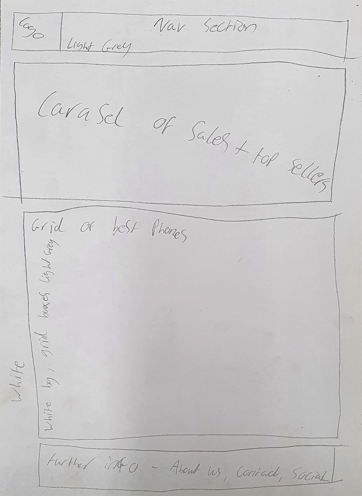
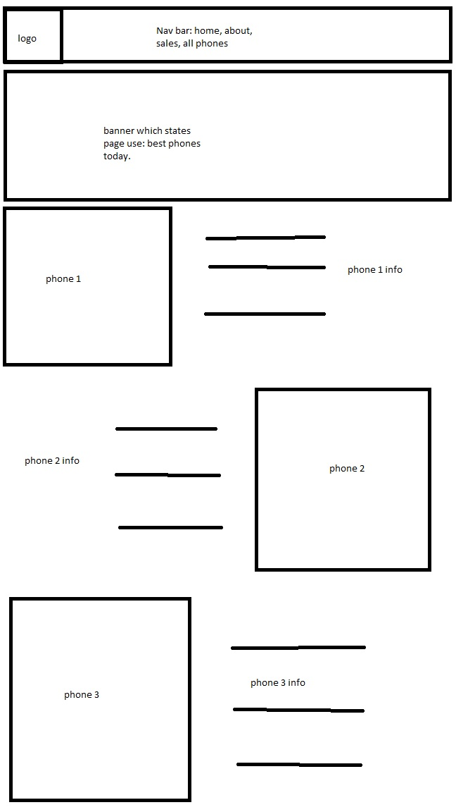
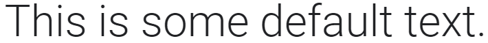
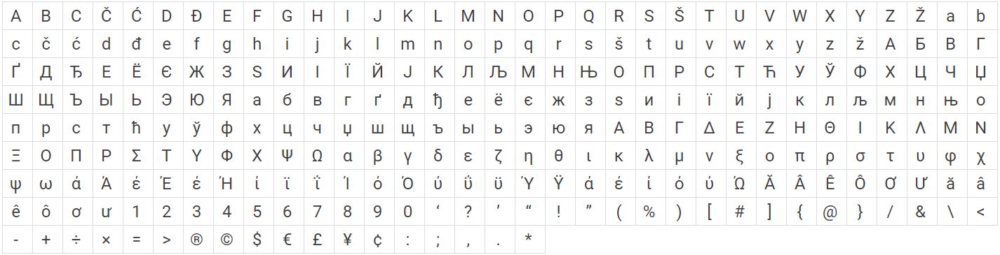
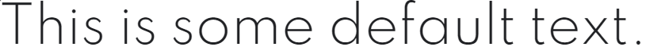
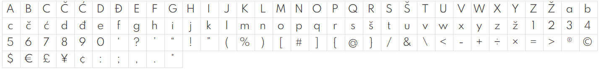

<link rel="preconnect" href="https://fonts.googleapis.com">
<link rel="preconnect" href="https://fonts.gstatic.com" crossorigin>
<link href="https://fonts.googleapis.com/css2?family=Roboto:wght@300&display=swap" rel="stylesheet">
<link href="https://fonts.googleapis.com/css2?family=Spartan:wght@300&display=swap" rel="stylesheet">

## Customers.

+ Product info: this is a website for selling mobile devices i.e. phones.
+ It needs to be easily accessible i.e. clear colour schemes for people with visual impairments.
+ Must be a simple layout so not to confuse viewers trying to find a product.
+ Must be quick to load such as using sprites instead of whole images, and only using elements where necessary.

## Owners.

+ Needs to be visually appealing to catch the attention of viewers.
+ Must be a professioanl style layout such as no goofy images or text styles.
+ Must be finacially viable and generate an income.
+ Must be cheap to operate (running costs must be lower than profit generated)

## Developers/Basic requirements.

+ Must be well documented, show what has been done.
+ Must be maintainable.
+ Must be easy to test, make a list of what needs testing.
+ Must have design standards, dont cheap out on specific sections.
+ Must be fast to load.

## Basic Design Scheme.
+ 
+ .color-primary-0 { color: #F9FEFF }	/* Main Primary color */
+ .color-primary-1 { color: #CBCBCB }
+ .color-primary-2 { color: #9BD7E5 }
+ .color-primary-3 { color: #4DAAC0 }
+ .color-primary-4 { color: #023C49 }
### Colour Uses.
+ Bg: #F9FEFF
+ Grid bg: #9BD7E5
+ Spare colour: #4DAAC0
+ Nav: #CBCBCB
+ Text: #023C49

Reason for colour choice was to be clear to see and be based around a phones back glass. 
The bg is to be white as to make the main elements stand out against it. Nav will be a light grey which makes it stand out against the bg but not be too in your face against the rest of the elements.
Text will be a very dark blue which could be used as a default text colour due to how well it stands out against the other colours.
Grid bg is light blue which makes the grid elements stand out against the main bg, while not obscuring the details about each device.
Spare colour is a slightly darker blue which can be used for additioanl elements if necessary.

## Design Idea 2.
+ 
+ .color-primary-0 { color: #A6B37E }	/* Main Primary color */
+ .color-primary-1 { color: #EEF4DD }
+ .color-primary-2 { color: #CCD6AD }
+ .color-primary-3 { color: #86965A }
+ .color-primary-4 { color: #617037 }
### Colour Uses.
+ Bg: #EEF4DD
+ Nav: #CCD6AD
+ Grid bg: #A6B37E
+ Spare colour: #86965A
+ Text: #617037

Reason for colour choice was that it is based off the olive colour from the Samsung Galaxy S21 FE. 
It shows light contrasted colours up to darker tones to provide a matching scheme throught the web page. The bg will be a white colour with a green tinge to allow the main images to stand out instead of being overshadowed by more vibrant colours.
Nav will be a slightly more green colour allowing it to show out as an element while not being too in your face.
The grid background will be darker than the nav which make each box show out against the background, highlighting the device info.
Text will show as the darkest olive green to show up  clearly 
(must be used where necessary).
Spare colour to be used when needed i.e. additional elements.
### Final Decision.
The final colour choice will be Design 1 as it has a much wider range of contrast when compared to Design 2. This was also confirmed by use of a third party which they stated there was a better contrast range along with the colours feeling more appropriate for a phone shop.

Adam's statement: I feel like the greens of the design 2 wouldnt suit the vibe of a mobile phone website more of a outdoors and fishing website. Where as on the other hand the whites and blue's do feel like the right colours for a phone website as blue is a colour linked to electronics and most companies use blue in their design. There is a better contrast on design 1 over design 2 as the greens kinda blend too much compared to the white blues and dark blue. uwu!  

## Basic Design Layout.

### Design 1.
I decided to use a carasel as this would be the most interactive way and visually appealing to viewers which would grab their attention on the best phones available. I then chose a grid layout as this way they can see the best phones available and the grid almost acts as a way of self advertisement by being on the home page.

### Design 2.
For this design, the navigation will be a similar format but instead of a carasel, it will use a large banner to grab ther viewers attention with something like "Check out the best phones today!", then below it will use alternating lists which display an image of the phone, then a basic description next to it, such as features, camera, battery etc.

### Final design choice.
The final choice for the design will be design 1 due to it having a more interactive feel than design 2. Since design 1 has a carasel, this makes design 2 feel very static in comparison. The grid of design 1 has a much better feel than the list in design 2 as its neatly layed out and can display more devices on screen while not feeling too crouded whereas the list type layout feels like a lot of wasted space, making the webpage feel very empty.

## Design choice revision 1.

Reason for choice was so that the measurements were easier to make and the page can also be displayed on the screen all at once. all the elements are the same as the original design but in a different orientation. Mobile version will follow the original layout in a later version. NOTE: the logo will act as the home button.

## Font Styles.
Requirements: It must have a modern design style with easy readability. Must be open soucrce or free to use commercially.
### First style.

I decided to first try using "Roboto Light 300" due to its minimalistic design providing a modern look to the website. Its clear to read due to its basic geometry therefore meaning much more accessible to viewers with reading and/or sight impairement. 

"https://fonts.googleapis.com/css2?family=Roboto:wght@300&display=swap"

### Second Style.

the next style i chose was "Spartan Light 300". It has a similar design style to the first one but uses a different style "a" and the "u" doesnt have the tail. overal it has a more simplified style similar to the one that Google uses meaning it is very easy to read for those with sight impairement.

"https://fonts.googleapis.com/css2?family=Spartan:wght@300&display=swap"

### Shared font attributes.
The standard weight (300) will be used for general text such as info, whereas headings and titles will use something between 500 and 900 to really stand out and grab the attention of the viewer, this can also be used to highlight some important info such as "*Case not included". The default text size will be around the 16px margin as it wont take up too much screen space but will still be readable. Any titles which need to stand out will be upped to 32px, this makes it stand out to the viewer so any important info they need to see such as a price will be obvious to them, this font size will apply to prices aswell.

### Final font choice.
I will be using design 2 as it has a more familar appearance with certain letters such as the "a" having a more hand written appearance, while still maintaining a more modern and clear format.

## Logo design.

### Reasons for design choice.
The logo was to be based around technology meaning a power logo you would find on computers with a lightning bolt through the middle to show power, along with the name of the compnay inside the ring. The colour follows the design scheme of the website. 

## Navigation.
### How it works.
+ x = Yes (Navigation available)
+ m = Maybe (Design may or may not contain this link)

The table shows how the navigation elements are linked.  EXAMPLE: If you want to go FROM "Home" TO "Contact Us", this link is available so it is marked with an "x". But if you want to go FROM "phone 1" TO "phone 7" this link is not available so will be left blank. With the "top sellers" and "Deals!" it has not been decided what phones will be chosen so therefore has been marked with an "m". 

| Column - FROM Row - TO | home | All Phones | Deals! | Top Sellers | Contact Us | About Us | Phone 1 | Phone 2 | Phone 3 | Phone 4 | Phone 5 | Phone 6 | Phone 7 | Phone 8 | Phone 9 |
|---|---|---|---|---|---|---|---|---|---|---|---|---|---|---|---|
| home | x | x | x | x | x | x | x | x | x | x | x | x |  |  |  |
| All Phones | x | x | x | x | x | x | x | x | x | x | x | x | x | x | x |
| Deals! | x | x | x | x | x | x | m | m | m | m | m | m | m | m | m |
| Top Sellers | x | x | x | x | x | x | m | m | m | m | m | m | m | m | m |
| Contact Us | x | x | x | x | x | x |  |  |  |  |  |  |  |  |  |
| About Us | x | x | x | x | x | x |  |  |  |  |  |  |  |  |  |
| Phone 1 | x | x | x | x | x | x |  |  |  |  |  |  |  |  |  |
| Phone 2 | x | x | x | x | x | x |  |  |  |  |  |  |  |  |  |
| Phone 3 | x | x | x | x | x | x |  |  |  |  |  |  |  |  |  |
| Phone 4 | x | x | x | x | x | x |  |  |  |  |  |  |  |  |  |
| Phone 5 | x | x | x | x | x | x |  |  |  |  |  |  |  |  |  |
| Phone 6 | x | x | x | x | x | x |  |  |  |  |  |  |  |  |  |
| Phone 7 | x | x | x | x | x | x |  |  |  |  |  |  |  |  |  |
| Phone 8 | x | x | x | x | x | x |  |  |  |  |  |  |  |  |  |
| Phone 9 | x | x | x | x | x | x |  |  |  |  |  |  |  |  |  |

## Sources.
| Source                                                                                                           | Name                        |
|------------------------------------------------------------------------------------------------------------------|-----------------------------|
| https://www.armstrongsgroup.com/contact/facebook-logo-black-and-white-png/                                       | Facebook Logo               |
| https://www.flaticon.com/free-icon/twitter-logo-on-black-background_60580                                        | Twitter Logo                |
| https://icon-library.com/images/checkout-icon/checkout-icon-13.jpg                                               | Checkout image              |
| https://img.us.news.samsung.com/us/wp-content/uploads/2022/02/09102459/Galaxy-S22-Series-2-scaled.jpg            | Carousel Image 1            |
| https://www.gizmochina.com/wp-content/uploads/2018/02/p20-pro-1.jpg                                              | Carousel Image 2            |
| https://www.myfixguide.com/wp-content/uploads/2021/06/nokia-c20-plus-2.jpg                                       | Carousel Image 3            |
| https://media.wired.com/photos/6008b7cd103a85a519187c3e/master/pass/Gear-galaxys21_plus_phantom_silver_front.jpg | Samsung Galaxy S21          |
| https://m.media-amazon.com/images/I/61RhKubN4HL._AC_SL1000_.jpg                                                  | Samsung Galaxy Z Flip       |
| https://www.samsung.com/us/business/smartphones/galaxy-z-fold3-5g/buy/                                           | Samsung Galaxy Z Fold       |
| https://www.backmarket.co.uk/second-hand-iphone-11-128-gb-black-unlocked/290063.html                             | iPhone 11                   |
| https://www.apple.com/uk/shop/buy-iphone/iphone-12/6.1-inch-display-64gb-purple                                  | iPhone 12                   |
| https://www.apple.com/uk/shop/buy-iphone/iphone-13-pro/6.1-inch-display-1tb-silver                               | iPhone 13 Pro               |
| https://consumer.huawei.com/content/dam/huawei-cbg-site/common/mkt/pdp/phones/nova9/specs/list-blue.png          | Huawei Nova 9               |
| https://www.techinn.com/f/13790/137905231/nokia-8.3-5g-8gb-128gb-6.8-smartphone.jpg                              | Nokia 8.3                   |
| https://www.notebookcheck.net/fileadmin/Notebooks/Motorola/Moto_G100/4_zu_3_moto_g100.jpg                        | Motorola G100               |
| https://www.youtube.com/embed/3xti4p2zz8k                                                                        | Samsung Galaxy S21 Video    |
| https://www.youtube.com/embed/KAKoW-0y3Cw                                                                        | Samsung Galaxy Z Flip Video |
| https://www.youtube.com/embed/Zeem5VOiqjM                                                                        | Samsung Galaxy Z Fold Video |
| https://www.youtube.com/embed/hVpkbiQ9E4c                                                                        | iPhone 11 Video             |
| https://www.youtube.com/embed/X1b3C2081-Q                                                                        | iPhone 12 Video             |
| https://www.youtube.com/embed/d15MF53bW4I                                                                        | iPhone 13 Pro Video         |
| https://www.youtube.com/embed/pRL5YqwZQ4U                                                                        | Huawei Nova 9 Video         |
| https://www.youtube.com/embed/4WCpCE3V-No                                                                        | Nokia 8.3 Video             |
| https://www.youtube.com/embed/fPvpUJOm8Xk                                                                        | Motorola G100 Video         |
| https://www.gsmarena.com/                                                                                        | All Phone Specs             |
| https://www.phonearena.com/                                                                                      | All Phone Descriptions      |

# Development Revision 1. aaa
When creating the webpage in visual code, some measurements had to be changed due to incorrect positioning or incorrect sizing. Changing specific sizes allowed the website layout to function correctly without certain elements being out of bounds.

# Feedback 1.
First amount of feedback was about adding an additional colour to the existing colour scheme to add more contrast to the web page; This has now been implemented.
Second set of feedback was about removing the vertical scroll on the page so everything fits into one page. This will  be worked on and will  be reflected in upcoming development stages. Currently this only functions on 1920x1080p resolution monitors which is to be improved upon on later versions.

## Feedback response.
Regarding the layout for fitting all on screen, steps have been taken to improve upon this, as such the header and footer have been reduced by 25px each. Next step was to reduce the spacing between elements to remove any excess whitespace while still keeping the elements seperate; Spacing has been reduced from 20px to 10px. This also required resizing most elements to make up for removing the whitespace.
Regarding the colour lacking much life, minor changes have been made, but drastic changes such as changing the page background would compromise the aesthetic of the site.

# Final tests performed.
+ Spell check all pages and elements. (Confirmed correct)
+ Confirm all links functional. (Confirmed working)
+ confirm all images render correctly. (Confirmed correct)
+ Confirm all information correct. (Confirmed correct)

# Finished Design Features.
+ Carousel on home page with 6 phones on the right with active links to the respective pages.
+ 9 phones each with their own description pages.
+ Contact us page with "realistic" contact info.
+ Deals and top sellers pages each with selected phones.
+ 9 fleshed out phone webpages each with their own information, specification table and review video.

## Third party review of finished product.
### Ashley Gould
It looks profesional, colourful and well designed. (no improvements stated)

### Adam Hurst.
The website is quite colourful and well laid out, The website is very easy to navigate and use. The prices and the specs are easily accesible. (no improvements stated)

### Aidan Scowen.
Phone site videos could be muted upon clicking on.
The sharp edges (boxes, rectangles, etc) could use rounding a small bit to visually look nice.
The social media icons could use their original colouring to fit their branding.
It looks very nice, and smooth. Hovering on objects look really interactive and feels good.
Phone sites look really good, laid out really well and organised.
  (Improvements listed: videos muted by default. smooth corners of elements. default colours to social media icons.)

### *All statements have been typed out by the reviewers.

### All feedback isted.
+ Mute videos by default. (This will be added to the current version. (Now implemented))
+ Smooth corners of elements. (This will  be improved upon in the next version. This is because it will require resiszing most if not all elements and may/will cause layout display issues such as misaligned content.)
+ Default colours of social media icons. (This will not be changed as it fits inline with the colour scheme of the website.)

# To be designed at a later date.
+ Improved visuals: The main interface could most likely be fleshed out more to show more vibrant colours making it more eye catching to viewers.
+ Official social media and email: The current contact information is only a suggested name, there is currently no facebook, twitter or email, and the social media icons on the footer currently do not function (although the ones in the contact us section do lead to a little easter egg.)
+ Functional checkout page: Currently the checkout icon on the phone pages only act as a placeholder, possible development may introduce a fucntional checkout page. (it does however lead to the easter egg)
+ Larger range of phones: Currently only 9 have been created but more will hopefully be implemented.
+ Search bar: There is currently no search function, only the "All Phones" page. this will hopefully be implemented at a later date but will follow after more phones have been implemented.
+ Auto resize content: Currently the page is viewed at a fixed 1920x1080p resolution meaning that any screen smaller than the size will not be able to display all the content on screen (but can still scroll to view hidden content). This is a known design flaw and will hopefully be corrected/improved on in further builds.
+ Improve the "About Us": There isn't much info displayed here right now, but this will be fleshed out at a later date.
+ Improved folder structure: Currently the organisation of folders are not very organised if at all. This will  be done at a later date as it would require me to change all paths of elements in the webpages. If a page has been moved to a different location (a different folder) it causes all elements and links to break.
# Operation13
